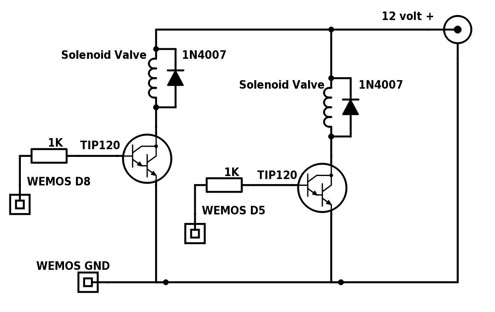

Greenhouse watering project
===========================

Shopping list
-------------
* [Wemos D1 mini](https://www.wemos.cc/product/d1-mini.html)
* [Wemos OLED shield](https://www.wemos.cc/product/oled-shield.html)
* [Wemos DC power shield](https://www.wemos.cc/product/dc-power-shield.html)

* 2 [Water values](https://www.adafruit.com/products/997)
* 2 [Liquid flow meters](https://www.adafruit.com/products/833)
* 2 TIP120 darlington transistors
* 2 1N4007 diodes
* 2 1KOhm resistors
* A DHT21 sensor, I use the AM2301

Assembly
--------

Hooking up the solenoids to the Wemos D1 mini:

Programming
-----------
